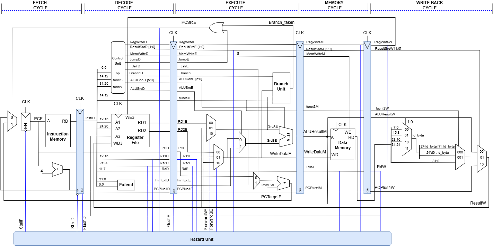
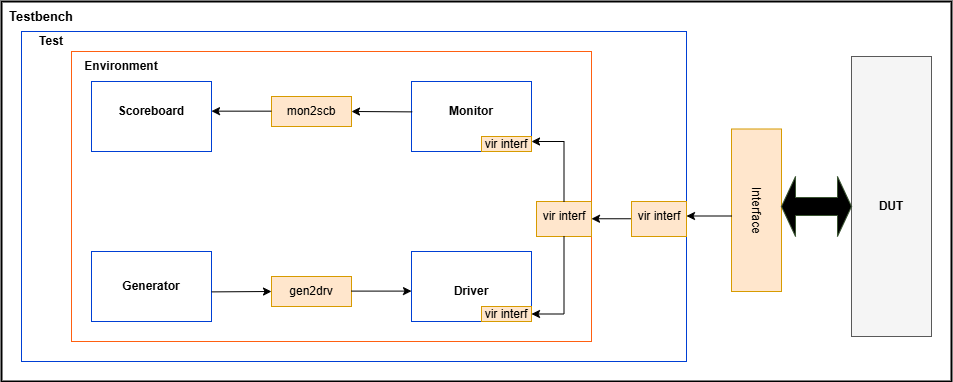
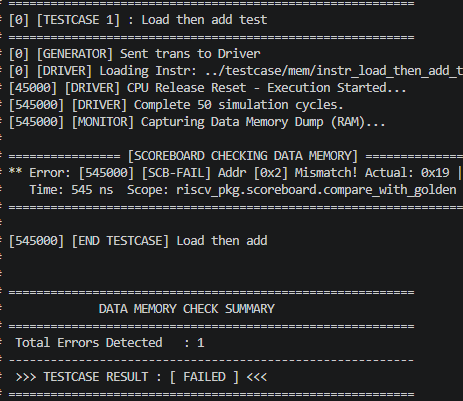
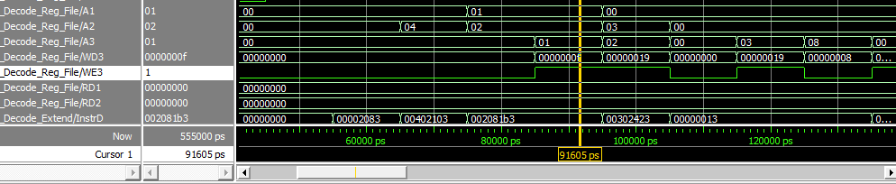
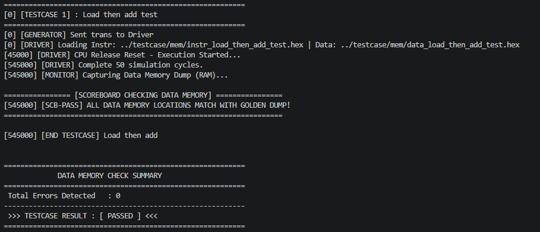
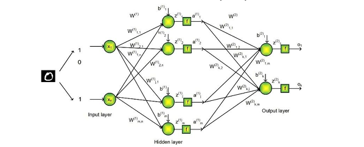
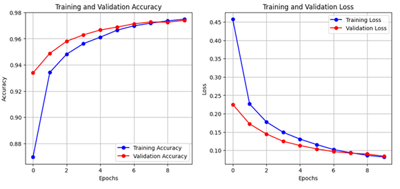
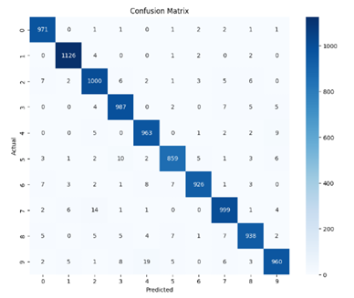
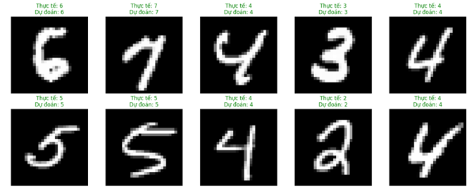
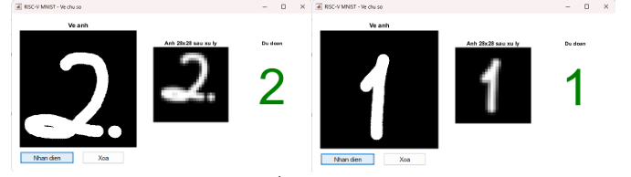

<!-- ABOUT THE PROJECT -->
## About The Project

This project focuses on designing and verifying a 5-stage pipelined **RISC-V CPU core** in SystemVerilog, integrated with a hardware-software co-simulation framework for **MNIST handwritten digit recognition**.

The CPU architecture incorporates hazard management—including data forwarding, hardware stalling, and pipeline flushing—to maintain correct instruction execution across pipeline stages. To ensure hardware correctness, a layered SystemVerilog verification environment was built alongside a software interface to perform real-world AI inference testing.

### Key Features

* **5-Stage Pipelined CPU Core:** Implements standard RISC-V execution stages: Fetch (IF), Decode (ID), Execute (EX), Memory (MEM), and WriteBack (WB).
* **Hazard & Forwarding Unit:** Resolves data hazards via internal register bypassing and EX/MEM forwarding, while handling Load-Use stalls and branch control flushes.
* **OOP Verification Environment:** A SystemVerilog testbench featuring Generator, Driver, Monitor, and Scoreboard components for automated verification.
* **Handwritten Digit Classification:** Integrates a trained Multi-Layer Perceptron (MLP) model for processing MNIST digit data.
* **HW/SW Co-Simulation:** Includes a MATLAB GUI for real-time hand-drawn digit input and functional hardware validation.
### Project Architecture

#### DUT Architecture



#### Verification Environment

### Project Components

#### RTL Modules

* **[Top.sv](Five_Stage_Pipeline_RISCV/rtl/Top.sv)**: The top-level wrapper module that instantiates and interconnects all five pipeline stages along with the Hazard Unit.
* **[Fetch_Cycle.sv](Five_Stage_Pipeline_RISCV/rtl/Fetch_Cycle.sv)**: The Instruction Fetch (IF) stage module. Fetches instructions from Instruction Memory based on the Program Counter (PC) and computes the next PC value.
* **[Decode_Cycle.sv](Five_Stage_Pipeline_RISCV/rtl/Decode_Cycle.sv)**: The Instruction Decode (ID) stage module. Handles instruction decoding, control signal generation, immediate sign-extension, and Register File reads.
* **[Execute_Cycle.sv](Five_Stage_Pipeline_RISCV/rtl/Execute_Cycle.sv)**: The Execute (EX) stage module. Contains the ALU for arithmetic/logic operations, target branch address calculation logic, and branch condition evaluation.
* **[Memory_Cycle.sv](Five_Stage_Pipeline_RISCV/rtl/Memory_Cycle.sv)**: The Memory Access (MEM) stage module. Manages read and write interactions with the Data Memory for Load and Store instructions.
* **[Write_Back_Cycle.sv](Five_Stage_Pipeline_RISCV/rtl/Write_Back_Cycle.sv)**: The Write-Back (WB) stage module. Selects the appropriate result (from the ALU, Data Memory, or PC+4) to write back into the target register.
* **[Hazard_Unit.sv](Five_Stage_Pipeline_RISCV/rtl/Hazard_Unit.sv)**: The hazard control unit. Resolves data hazards through forwarding mechanisms and handles control/load-use hazards by driving pipeline stall and flush control signals.

#### SystemVerilog Testbench

* **[riscv_pkg.sv](Five_Stage_Pipeline_RISCV/tb/riscv_pkg.sv)**: Package defining memory data types (`data_mem_t`) and including all verification components.
* **[transaction.sv](Five_Stage_Pipeline_RISCV/tb/transaction.sv)**: Configuration object storing file paths (`instr_hex_file`, `data_hex_file`, `golden_dump_file`) and simulation cycle count (`run_cycles`).
* **[generator.sv](Five_Stage_Pipeline_RISCV/tb/generator.sv)**: Pass-through relay component that forwards transaction configuration objects to the driver via mailbox.
* **[driver.sv](Five_Stage_Pipeline_RISCV/tb/driver.sv)**: Preloads Instruction and Data memories, toggles reset (`rstn`), and waits for test execution cycles.
* **[monitor.sv](Five_Stage_Pipeline_RISCV/tb/monitor.sv)**: Captures the full Data Memory array dump from the interface and forwards it to the scoreboard.
* **[scoreboard.sv](Five_Stage_Pipeline_RISCV/tb/scoreboard.sv)**: Loads the golden `.hex` reference file and compares all RAM locations against actual memory dump.
* **[environment.sv](Five_Stage_Pipeline_RISCV/tb/environment.sv)**: Top verification container instantiating and interconnecting generator, driver, monitor, and scoreboard via mailboxes.
* **[interface.sv](Five_Stage_Pipeline_RISCV/tb/interface.sv)**: Interface encapsulating reset, Data RAM snapshot array, and task for hierarchical memory initialization.
* **[testbench.sv](Five_Stage_Pipeline_RISCV/tb/testbench.sv)**: Top-level simulation module that generates clock, instantiates CPU, mirrors Data RAM, and selects testcases via.
### Verification Plan

| Section | Testname | Description | Method |
| :--- | :--- | :--- | :--- |
| **1. Basic Pipeline Flow** | `basic_pass_through_test` | Executes `lw x1, 0(x0)` &rarr; NOP padding &rarr; `sw x1, 4(x0)`. Verifies standard sequential execution without hazards. | Directed |
| | `ALU_store_test` | Executes `lw x1, 0(x0)` & `lw x2, 4(x0)` &rarr; NOP padding &rarr; `add x3, x1, x2` &rarr; NOP padding &rarr; `sw x3, 8(x0)`. | Directed |
| **2. Data Hazard & Forwarding** | `ALU_forwarding_test` | Executes `addi x1, x0, 10` followed immediately by `add x2, x1, x1`. Verifies direct data bypassing from EX/MEM stage to ALU inputs for `x1`, followed by `sw x2, 0(x0)`. | Directed |
| | `store_data_hazard_test` | Executes `addi x1, x0, 50` followed immediately by `sw x1, 0(x0)`. Verifies data forwarding from EX/MEM stage to MEM stage for Store instructions. | Directed |
| **3. Load-Use Hazard & Stalling** | `load_then_add_test` | Executes back-to-back `lw x1, 0(x0)` and `lw x2, 4(x0)`, directly followed by `add x3, x1, x2` and `sw x3, 8(x0)`. Verifies execution handling for back-to-back memory load dependencies. | Directed |
| | `load_use_hazard_test` | Executes `lw x1, 0(x0)` followed immediately by `add x2, x1, x1`. Verifies Hazard Unit automatically stalls 1 cycle (`StallF`, `StallD`, `FlushE`) before forwarding `x1` to ALU and performing `sw x2, 4(x0)`. | Directed |
| **4. Control Hazard & Flushing** | `control_hazard_test` | Executes branch instruction sequence (`beq`/`bne`). Verifies that when a branch is taken (`PCSrcE=1`), the Hazard Unit flushes speculative instructions at Decode (`FlushD`) and Execute (`FlushE`) stages. | Directed |

### Achievements of verification
#### Verification Data Flow

The log below illustrates the step-by-step data flow of the testbench during the execution of the **[load_then_add_test.sv](Five_Stage_Pipeline_RISCV/testcase/load_then_add_test.sv)**. The verification components operate seamlessly across simulation timestamps:
* **Generator & Driver**: Construct transaction objects containing hex file paths and drive the CPU setup by preloading Instruction Memory (`instr.hex`) and Data Memory (`data.hex`) through the virtual interface (`vif.load_hex()`).
* **Monitor**: Accurately samples and captures the full 1024-word Data Memory array dump from the DUT upon completion of execution cycles.
* **Scoreboard**: Receives actual memory dumps from the Monitor, loads the expected reference data (`golden.hex`), and performs automated word-by-word cross-comparison.


Test Outcome of **[load_then_add_test.sv](Five_Stage_Pipeline_RISCV/testcase/load_then_add_test.sv)** : **FAIL**

##### Fixing bugs:
Follow by the instruction for the testcase: 
```assembly
00002083    // lw  x1, 0(x0)  Cycle A
00402103    // lw  x2, 4(x0)  Cycle B
002081b3    // add x3, x1, x2 Cycle C
00302423    // sw  x3, 8(x0)  Cycle D
```

Cycle C Issue Analysis: During Cycle C, the 1st instruction (lw x1) reaches the WriteBack stage, driving the loaded data to WD3 with destination register x1 (A3 = 1). Simultaneously, the 3rd instruction (add x3, x1, x2) in the Decode stage attempts to read x1 (A1 = 1) to supply the operand RD1 for execution.

This created a simultaneous Read and Write operation on the same register address (x1), resulting in a Read-During-Write hazard. Because the register file lacked internal bypassing, RD1 picked up the stale (old) value before the write completed, leading to an incorrect calculation.

Resolution: Fixed by implementing Internal Forwarding (Write-First logic) within the Register File module. When a read address matches an active write address (A1 == A3 with WE3 enabled), the incoming write data (WD3) is directly forwarded to the read port (RD1). Check the mark (resolution) of the line 25 of **[Decode_Reg_File.sv](Five_Stage_Pipeline_RISCV/rtl/Decode_Reg_File.sv)**

##### Final result:


### Software & Model Training

#### Model Architecture

The neural network is structured as a Multi-Layer Perceptron (MLP) for MNIST handwritten digit classification:
* **Input Layer:** Accepts flattened input feature vectors ($x_1 \dots x_n$).
* **Hidden Layer:** Computes linear transformations $z^{(1)} = W^{(1)}x + b^{(1)}$ followed by activation function $f$ to output hidden activations $a^{(1)}_1 \dots a^{(1)}_m$.
* **Output Layer:** Transforms hidden activations into final class scores $z^{(2)} = W^{(2)}a^{(1)} + b^{(2)}$, producing output logits $o_1 \dots o_k$ corresponding to target digit classes (0–9).
#### Training Results

##### Accuracy and Loss Curves

##### Confusion Matrix

##### Sample Inference Visualizations

### Co-Simulation Results



The system was evaluated in real-time using 20 user-drawn handwritten digit images through a MATLAB GUI interface. Key performance metrics and observations include:

* **Recognition Accuracy:** Achieved **90% accuracy** (correctly identifying 18 out of 20 custom hand-drawn images).
* **Processing Time:** The average execution time per inference cycle was **5.65 seconds**.
* **Latency Analysis:** The latency is primarily attributed to the file I/O overhead associated with exchanging intermediate data files between the two software environments.
* **Hardware Verification:** Directly incorporating the RTL model into the execution loop successfully verified the functional correctness and behavioral accuracy of the hardware design, confirming the feasibility of co-simulation for FPGA-targeted AI acceleration systems.